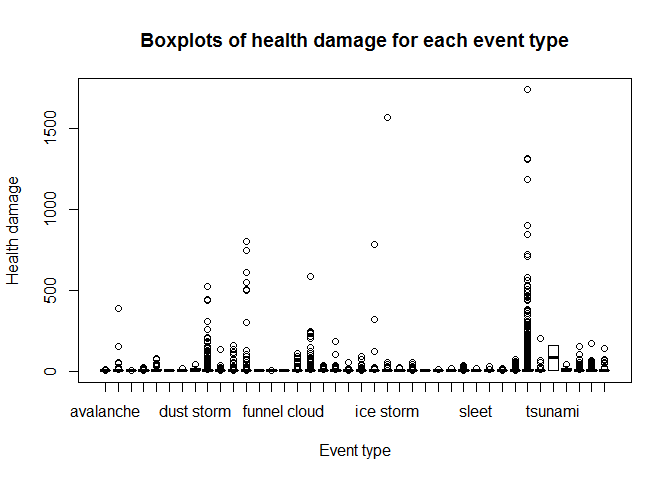

# Analysis of the Health and Economic Consequences of the Severe Weather Events

##Synopsis

##Data Processing

In the presented data anlysis, we aim to answer the following two questions:  

1. Across the United States, which types of events (as indicated in the `EVTYPE` variable) are most harmful with respect to population health?
2. Across the United States, which types of events have the greatest economic consequences?

In order to answer these questions we explore the U.S. National Oceanic and Atmospheric Administration's (NOAA) storm database which tracks characteristics of major storms and weather events in the United States, including when and where they occur, as well as estimates of any fatalities, injuries, and property damage. The events in the database start span the time period from the year 1950 until November 2011.  

Firstly, we load the raw data from a comma-separated-value file compressed via the bzip2 algorithm `repdata-data-StormData.csv.bz2` and rename the columns with lowercase for easier manipulation.


```r
library(dplyr)
col_classes <- c("character", "character", "character", "character", "character")
names(col_classes) <- c("BGN_DATE", "BGN_TIME", "TIME_ZONE", "END_DATE", "END_TIME")

storms <- tbl_df(read.csv("repdata-data-StormData.csv.bz2", colClasses = col_classes))
colnames(storms) <- tolower(colnames(storms))
```

Next, we process the data using a `dplyr` library. We add a new column `bgn_year` with a year when a recorded event occurred. We also transform `evtype` to lowercase and filter out the events wich are misclassified or are not necesserily a result of a natural phenomenon (such as *drowning*).


```r
library(lubridate)

storms <- storms %>% 
  mutate(bgn_year = year(mdy_hms(bgn_date)), evtype = tolower(as.character(evtype))) %>%
  filter(evtype != "drowning" & evtype != "other" & evtype != "high" & evtype != "?" &
         evtype != "apache county" & evtype != "marine accident" & evtype != "marine mishap")
```

Quick inspection of the recorded events tells us that despite the fact that the [Storm Data Documentation](https://d396qusza40orc.cloudfront.net/repdata%2Fpeer2_doc%2Fpd01016005curr.pdf) defines 48 types of events, there are actually many more than that.


```r
length(levels(as.factor(storms$evtype)))
```

```
## [1] 891
```

Therefore, cleaning of event types is necessary.


```r
storms$evtype <- gsub("^avalance", "avalanche", storms$evtype)
storms$evtype <- gsub("^snow squall.*", "blizzard", storms$evtype)
storms$evtype <- gsub("^blowing snow$*", "blizzard", storms$evtype)
storms$evtype <- gsub("^blizzard.*$*", "blizzard", storms$evtype)
storms$evtype <- gsub("^ground blizzard.*$*", "blizzard", storms$evtype)
storms$evtype <- gsub("^coastal flood.*", "coastal flood", storms$evtype)
storms$evtype <- gsub("^coastal flooding$", "coastal flood", storms$evtype)
storms$evtype <- gsub("^coastal *flooding.*$", "coastal flood", storms$evtype)
storms$evtype <- gsub("^coastal surge$", "coastal flood", storms$evtype)
storms$evtype <- gsub("^erosion/cstl flood$", "coastal flood", storms$evtype)
storms$evtype <- gsub("^beach erosion$", "coastal flood", storms$evtype)
storms$evtype <- gsub("^coastal erosion$", "coastal flood", storms$evtype)
storms$evtype <- gsub("^cold.*", "cold/wind chill", storms$evtype)
storms$evtype <- gsub("^low temperature$", "cold/wind chill", storms$evtype)
storms$evtype <- gsub("^hypothermia.*", "cold/wind chill", storms$evtype)
storms$evtype <- gsub("^unseasonably cold$", "cold/wind chill", storms$evtype)
storms$evtype <- gsub("^cool and wet$", "cold/wind chill", storms$evtype)
storms$evtype <- gsub("^drought.*", "drought", storms$evtype)
storms$evtype <- gsub("^blowing dust", "dust storm", storms$evtype)
storms$evtype <- gsub("^dust devil.*", "dust devil", storms$evtype)
storms$evtype <- gsub("^extreme heat$", "excessive heat", storms$evtype)
storms$evtype <- gsub("^record heat$", "excessive heat", storms$evtype)
storms$evtype <- gsub("^hyperthermia.*", "excessive heat", storms$evtype)
storms$evtype <- gsub("^record/excessive heat$", "excessive heat", storms$evtype)
storms$evtype <- gsub("^extended cold", "extreme cold/wind chill", storms$evtype)
storms$evtype <- gsub("^extreme cold$", "extreme cold/wind chill", storms$evtype)
storms$evtype <- gsub("^extreme windchill$", "extreme cold/wind chill", storms$evtype)
storms$evtype <- gsub("^record cold$", "extreme cold/wind chill", storms$evtype)
storms$evtype <- gsub("^ *flash flood.*", "flash flood", storms$evtype)
storms$evtype <- gsub("^rapidly rising water", "flash flood", storms$evtype)
storms$evtype <- gsub("^breakup flooding", "flash flood", storms$evtype)
storms$evtype <- gsub("^minor flooding$", "flood", storms$evtype)
storms$evtype <- gsub("^dam break$", "flood", storms$evtype)
storms$evtype <- gsub("^.* fld$", "flood", storms$evtype)
storms$evtype <- gsub(".* floodin$", "flood", storms$evtype)
storms$evtype <- gsub("^flood.*", "flood", storms$evtype)
storms$evtype <- gsub("^high water$", "flood", storms$evtype)
storms$evtype <- gsub("^tidal flooding$", "flood", storms$evtype)
storms$evtype <- gsub("^river flood.*", "flood", storms$evtype)
storms$evtype <- gsub("^frost$", "frost/freeze", storms$evtype)
storms$evtype <- gsub("^ic(e|y)( on)* road(s)*$", "frost/freeze", storms$evtype)
storms$evtype <- gsub("^freeze$", "frost/freeze", storms$evtype)
storms$evtype <- gsub("^damaging freeze$", "frost/freeze", storms$evtype)
storms$evtype <- gsub("^early frost$", "frost/freeze", storms$evtype)
storms$evtype <- gsub("^frost\\\\freeze$", "frost/freeze", storms$evtype)
storms$evtype <- gsub("^hard freeze$", "frost/freeze", storms$evtype)
storms$evtype <- gsub("^freezing rain.*", "sleet", storms$evtype)
storms$evtype <- gsub("^freezing drizzle", "sleet", storms$evtype)
storms$evtype <- gsub("^freezing spray", "sleet", storms$evtype)
storms$evtype <- gsub("^heavy mix", "sleet", storms$evtype)
storms$evtype <- gsub("^rain/snow", "sleet", storms$evtype)
storms$evtype <- gsub("^fog and cold temperatures$", "freezing fog", storms$evtype)
storms$evtype <- gsub("^black ice$", "hail", storms$evtype)
storms$evtype <- gsub("^small hail$", "hail", storms$evtype)
storms$evtype <- gsub("^ice$", "hail", storms$evtype)
storms$evtype <- gsub("^ice storm.*", "ice storm", storms$evtype)
storms$evtype <- gsub("^glaze.*", "hail", storms$evtype)
storms$evtype <- gsub("^hail.*", "hail", storms$evtype)
storms$evtype <- gsub("^falling snow/ice$", "sleet", storms$evtype)
storms$evtype <- gsub("^light snow$", "sleet", storms$evtype)
storms$evtype <- gsub("^mixed precip$", "sleet", storms$evtype)
storms$evtype <- gsub("^unseasonably warm.*", "heat", storms$evtype)
storms$evtype <- gsub("^warm weather$", "heat", storms$evtype)
storms$evtype <- gsub("^heat wave.*", "heat", storms$evtype)
storms$evtype <- gsub("^heavy rain.*", "heavy rain", storms$evtype)
storms$evtype <- gsub("^excessive rainfall$", "heavy rain", storms$evtype)
storms$evtype <- gsub("^torrential rainfall$", "heavy rain", storms$evtype)
storms$evtype <- gsub("^rain/wind$", "heavy rain", storms$evtype)
storms$evtype <- gsub("^heavy precipitation$", "heavy rain", storms$evtype)
storms$evtype <- gsub("^heavy shower$", "heavy rain", storms$evtype)
storms$evtype <- gsub("^rain/wind$", "heavy rain", storms$evtype)
storms$evtype <- gsub("^hvy rain$", "heavy rain", storms$evtype)
storms$evtype <- gsub("^heavy snow.*", "heavy snow", storms$evtype)
storms$evtype <- gsub("^excessive snow$*", "heavy snow", storms$evtype)
storms$evtype <- gsub("^snow.*", "heavy snow", storms$evtype)
storms$evtype <- gsub("^thundersnow$", "heavy snow", storms$evtype)
storms$evtype <- gsub("^hazardous surf$", "high surf", storms$evtype)
storms$evtype <- gsub("^rough surf$", "high surf", storms$evtype)
storms$evtype <- gsub("^heavy surf.*", "high surf", storms$evtype)
storms$evtype <- gsub("^heavy seas$", "high surf", storms$evtype)
storms$evtype <- gsub("^high seas$", "high surf", storms$evtype)
storms$evtype <- gsub("^high swells$", "high surf", storms$evtype)
storms$evtype <- gsub("^heavy swells$", "high surf", storms$evtype)
storms$evtype <- gsub("^high waves$", "high surf", storms$evtype)
storms$evtype <- gsub("^high tides$", "high surf", storms$evtype)
storms$evtype <- gsub("^ *high surf.*$", "high surf", storms$evtype)
storms$evtype <- gsub("^high wind.*$", "high wind", storms$evtype)
storms$evtype <- gsub("^non-severe wind damage$", "high wind", storms$evtype)
storms$evtype <- gsub("^non tstm wind", "high wind", storms$evtype)
storms$evtype <- gsub("^wind.*", "high wind", storms$evtype)
storms$evtype <- gsub("^gusty wind.*", "high wind", storms$evtype)
storms$evtype <- gsub("^wind storm$", "high wind", storms$evtype)
storms$evtype <- gsub("^gradient wind$", "high wind", storms$evtype)
storms$evtype <- gsub("^hurricane.*", "hurricane (typhoon)", storms$evtype)
storms$evtype <- gsub("^typhoon$", "hurricane (typhoon)", storms$evtype)
storms$evtype <- gsub("^lightning.*", "lightning", storms$evtype)
storms$evtype <- gsub("^rip current.*", "rip current", storms$evtype)
storms$evtype <- gsub("^marine tstm wind", "marine thunderstorm wind", storms$evtype)
storms$evtype <- gsub("^storm surge$", "storm surge/tide", storms$evtype)
storms$evtype <- gsub("^rough seas$", "storm surge/tide", storms$evtype)
storms$evtype <- gsub("^rogue wave$", "storm surge/tide", storms$evtype)
storms$evtype <- gsub("^coastal.{0,1}storm$", "storm surge/tide", storms$evtype)
storms$evtype <- gsub("^strong wind.*", "strong wind", storms$evtype)
storms$evtype <- gsub("^thunder.{0,1}storm.*", "thunderstorm wind", storms$evtype)
storms$evtype <- gsub("^thundertorm winds$", "thunderstorm wind", storms$evtype)
storms$evtype <- gsub("^ *tstm.*", "thunderstorm wind", storms$evtype)
storms$evtype <- gsub("^dry microburst.*", "thunderstorm wind", storms$evtype)
storms$evtype <- gsub("^dry mircoburst.*", "thunderstorm wind", storms$evtype)
storms$evtype <- gsub("^microburst.*$", "thunderstorm wind", storms$evtype)
storms$evtype <- gsub("^downburst.*", "thunderstorm wind", storms$evtype)
storms$evtype <- gsub("^tornado.*", "tornado", storms$evtype)
storms$evtype <- gsub("^gustnado.*", "tornado", storms$evtype)
storms$evtype <- gsub("^whirlwind$", "tornado", storms$evtype)
storms$evtype <- gsub("^tropical storm.*", "tropical storm", storms$evtype)
storms$evtype <- gsub("^waterspout.*", "waterspout", storms$evtype)
storms$evtype <- gsub("^wild.{0,1}fire.*", "wildfire", storms$evtype)
storms$evtype <- gsub("^wild.{0,1}fire.*", "wildfire", storms$evtype)
storms$evtype <- gsub("wild/forest fire", "wildfire", storms$evtype)
storms$evtype <- gsub("^forest fire.*", "wildfire", storms$evtype)
storms$evtype <- gsub("^grass fires", "wildfire", storms$evtype)
storms$evtype <- gsub("brush fire$", "wildfire", storms$evtype)
storms$evtype <- gsub("^winter weather.*", "winter weather", storms$evtype)
storms$evtype <- gsub("^wintry mix$", "winter weather", storms$evtype)
storms$evtype <- gsub("^winter storm.*", "winter storm", storms$evtype)
storms$evtype <- gsub("^landslide.*", "landslide", storms$evtype)
storms$evtype <- gsub("^mudslide.*", "landslide", storms$evtype)
storms$evtype <- gsub("^mud slide.*", "landslide", storms$evtype)
storms$evtype <- gsub("^agricultural freeze", "frost/freeze", storms$evtype)
storms$evtype <- gsub("astronomical high tide", "high surf", storms$evtype)
storms$evtype <- gsub("^dust storm.*$", "dust storm", storms$evtype)
storms$evtype <- gsub("^excessive wetness$", "heavy rain", storms$evtype)
storms$evtype <- gsub("^extreme wind chill$", "extreme cold/wind chill", storms$evtype)
storms$evtype <- gsub("^heavy lake snow", "lake-effect snow", storms$evtype)
storms$evtype <- gsub("^ligntning", "lightning", storms$evtype)
storms$evtype <- gsub("^lighting$", "lightning", storms$evtype)
storms$evtype <- gsub("^record snow", "heavy snow", storms$evtype)
storms$evtype <- gsub("^record rainfall", "heavy rainfall", storms$evtype)
storms$evtype <- gsub("^severe thunderstorm.*$", "thunderstorm wind", storms$evtype)
storms$evtype <- gsub("^unseasonable cold", "cold/wind chill", storms$evtype)
storms$evtype <- gsub("^urban.*", "flood", storms$evtype)
storms$evtype <- gsub("^rural.*", "flood", storms$evtype)
storms$evtype <- gsub("^river and stream", "flood", storms$evtype)
storms$evtype <- gsub("^sleet.*", "sleet", storms$evtype)
storms$evtype <- gsub("^rock slide$", "landslide", storms$evtype)
storms$evtype <- gsub("^landslump$", "landslide", storms$evtype)
storms$evtype <- gsub("^lake effect snow$", "lake-effect snow", storms$evtype)
storms$evtype <- gsub("^wet microburst$", "heavy rain", storms$evtype)
storms$evtype <- gsub("^rain storm$", "heavy rain", storms$evtype)
storms$evtype <- gsub("^rainstorm$", "heavy rain", storms$evtype)
storms$evtype <- gsub("^mixed precipitation$", "sleet", storms$evtype)
storms$evtype <- gsub("^severe turbulence$", "thunderstorm wind", storms$evtype)
storms$evtype <- gsub("^thundeerstorm winds$", "thunderstorm wind", storms$evtype)
storms$evtype <- gsub("^thunderstrom wind$", "thunderstorm wind", storms$evtype)
storms$evtype <- gsub("^thunerstorm winds$", "thunderstorm wind", storms$evtype)
storms$evtype <- gsub("^tunderstorm wind$", "thunderstorm wind", storms$evtype)
storms$evtype <- gsub("^non-tstm wind$", "high wind", storms$evtype)
storms$evtype <- gsub("^light freezing rain$", "sleet", storms$evtype)
storms$evtype <- gsub("^ice and snow$", "ice storm", storms$evtype)
storms$evtype <- gsub("^small stream flood$", "flood", storms$evtype)
storms$evtype <- gsub("^ice jam.*$", "flood", storms$evtype)
storms$evtype <- gsub("^ice floes$", "flood", storms$evtype)
storms$evtype <- gsub("^ice/strong winds$", "ice storm", storms$evtype)
storms$evtype <- gsub("^light snowfall$", "winter weather", storms$evtype)
storms$evtype <- gsub("^late season snow$", "winter weather", storms$evtype)
storms$evtype <- gsub("^high  winds$", "high wind", storms$evtype)
storms$evtype <- gsub("^lake flood$", "lakeshore flood", storms$evtype)
storms$evtype <- gsub("^land slide$", "landslide", storms$evtype)
storms$evtype <- gsub("^landspout$", "tornado", storms$evtype)
storms$evtype <- gsub("^torndao$", "tornado", storms$evtype)
storms$evtype <- gsub("^unseasonal rain$", "heavy rain", storms$evtype)
storms$evtype <- gsub("^fog$", "dense fog", storms$evtype)
storms$evtype <- gsub("^major flood$", "flood", storms$evtype)
storms$evtype <- gsub("^rain$", "heavy rain", storms$evtype)
storms$evtype <- gsub("^storm force winds$", "thunderstorm wind", storms$evtype)
storms$evtype <- gsub("^flood flood$", "flood", storms$evtype)
storms$evtype <- gsub("^heavy rainfall$", "heavy rain", storms$evtype)
storms$evtype <- gsub("thunderstorm winds$", "thunderstorm wind", storms$evtype)
storms$evtype <- gsub("thuderstorm winds$", "thunderstorm wind", storms$evtype)
storms$evtype <- gsub("^wildfires$", "wildfire", storms$evtype)
```
##Results

Let us consider the questions separately. Firstly, we handle the events from the perspective of fatalities and injuries, i.e., health demages. We filter only events that caused any fatal or non-fatal injuries and combines these two numbers into a new columns `health_dmg`.


```r
health_harmful_events <- storms %>% 
  mutate(health_dmg = fatalities + injuries) %>%
  filter(health_dmg > 0)
```

In order to answer the first question, we aggregate the health harmful events according to the event type and find top 5 event types causing the most of damage to the health of the public comparing the total sum, average and median value.


```r
health_dmg_per_event <- health_harmful_events %>%
  mutate(evtype = as.factor(evtype)) %>%
  group_by(evtype) %>%
  summarise(count = length(health_dmg), total_health_dmg = sum(health_dmg), 
            total_fatalities = sum(fatalities), total_injuries = sum(injuries),
            avg_health_dmg = mean(health_dmg), avg_fatalities = mean(fatalities), 
            avg_injuries = mean(injuries), med_health_dmg = median(health_dmg), 
            med_fatalities = median(fatalities), med_injuries = median(injuries))

health_dmg_top5_total <- health_dmg_per_event %>% arrange(desc(total_health_dmg)) %>% head(5)
health_dmg_top5_avg <- health_dmg_per_event %>% arrange(desc(avg_health_dmg)) %>% head(5)
health_dmg_top5_median <- health_dmg_per_event %>% arrange(desc(med_health_dmg)) %>% head(5)
```

We can see that there are many outliers in the number of injuries (fatal and non-fatal together) for each event type, i.e., the events usually cause little harm, but there are several occasions when the number goes up significantly.


```r
boxplot(health_harmful_events$health_dmg ~ health_harmful_events$evtype)
title(main = "Boxplots of health damage for each event type", ylab = "Health damage",
      xlab = "Event type")
```

 

Therefore, the total sum of injuries might not be the best measure. Also, the mean will be significantly moved towards extreme values. On the other hand, if we were to consider only the median value, it might highlight events which occurred only few times as can be seen in the following table.


```r
library(xtable)
```

```
## Warning: package 'xtable' was built under R version 3.1.2
```

```r
xtable(as.data.frame(health_dmg_top5_median[, c("evtype", "med_health_dmg")]),
       caption = "Top 5 event types based on the median value of health damage that it causes")
```

```
## % latex table generated in R 3.1.1 by xtable 1.7-4 package
## % Sun Mar 22 22:41:05 2015
## \begin{table}[ht]
## \centering
## \begin{tabular}{rlr}
##   \hline
##  & evtype & med\_health\_dmg \\ 
##   \hline
## 1 & tsunami & 81.00 \\ 
##   2 & dust storm & 6.00 \\ 
##   3 & dense fog & 4.00 \\ 
##   4 & drought & 3.00 \\ 
##   5 & tornado & 3.00 \\ 
##    \hline
## \end{tabular}
## \caption{Top 5 event types based on the median value of health damage that it causes} 
## \end{table}
```

We can see that *tsunami* is at the first place, although it occurred only two times, while the *tornado* is fifth, although it occurred more almost 8,000 times. Therefore, we use the total sum of health damage as the sorting criterium.


```r
xtable(as.data.frame(health_dmg_top5_total[, c("evtype", "total_health_dmg")]),
       caption = "Top 5 event types based on the total sum of health damage that it causes")
```

```
## % latex table generated in R 3.1.1 by xtable 1.7-4 package
## % Sun Mar 22 22:41:05 2015
## \begin{table}[ht]
## \centering
## \begin{tabular}{rlr}
##   \hline
##  & evtype & total\_health\_dmg \\ 
##   \hline
## 1 & tornado & 97023.00 \\ 
##   2 & thunderstorm wind & 10251.00 \\ 
##   3 & excessive heat & 8749.00 \\ 
##   4 & flood & 7421.00 \\ 
##   5 & lightning & 6049.00 \\ 
##    \hline
## \end{tabular}
## \caption{Top 5 event types based on the total sum of health damage that it causes} 
## \end{table}
```

##Conclusions
